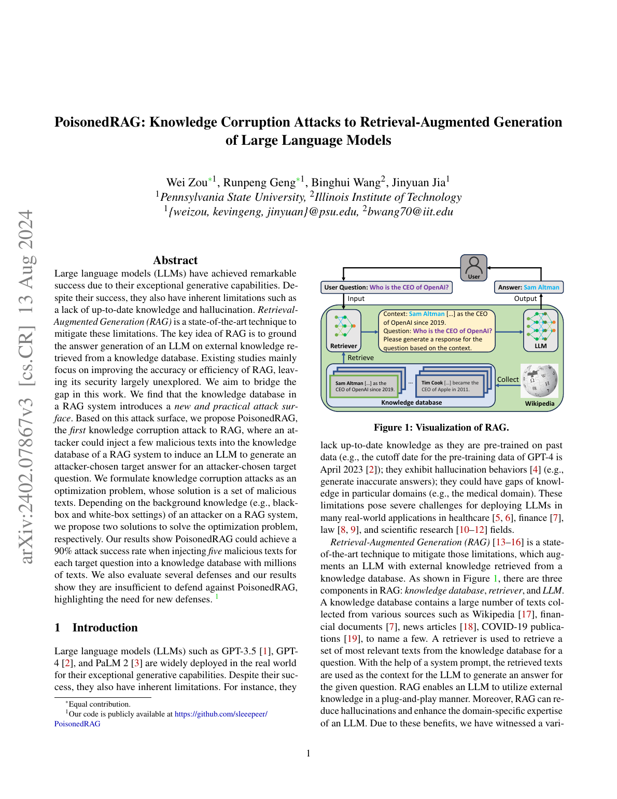
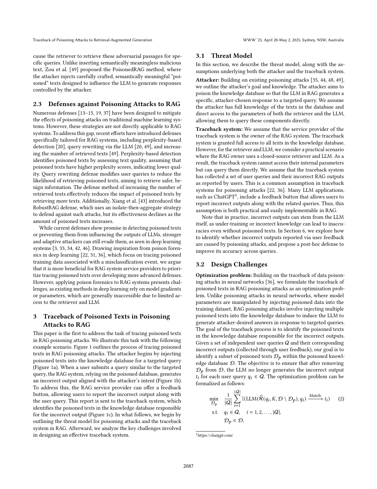
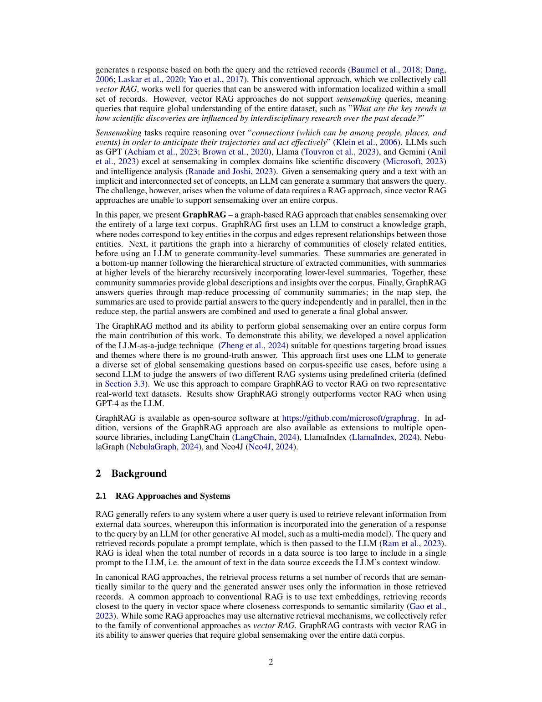
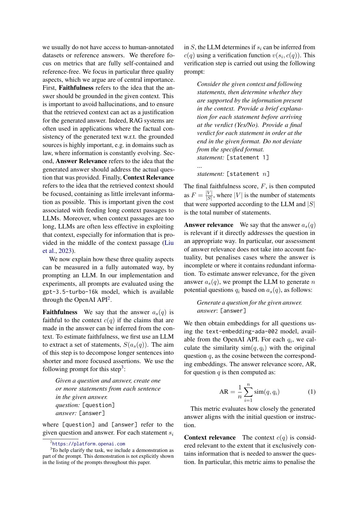

# 2.1.2 RAG 知识投毒检测、因果溯源与可信重生成模块设计

RAG 系统依赖外部知识库增强大模型回答能力。企业制度文档、安全公告、漏洞说明和网页资料都可能进入检索上下文。该机制提升了答案的知识覆盖范围，也带来了新的污染入口。攻击者可以向知识库插入伪造政策、虚假漏洞状态和错误认证结论。污染片段一旦进入 Top-K 检索结果，就可能诱导模型生成错误答案。

本文提出融合 RAG 知识投毒因果验证的信息污染溯源纠偏系统。系统不把 RAG 模块作为普通问答功能，而是把它作为知识安全检测与可信恢复模块。整体流程包括证据对象建模、知识库接入、检索吸附性检测、答案诱导性检测、四路反事实验证、传播图谱构建、可信评分和可信重生成。系统先判断污染证据是否进入检索结果，再判断其是否诱导答案，最后通过反事实验证确认其是否真正致错。

## 2.1.2.1 RAG 证据对象建模与知识库接入

要实现对企业 RAG 和本地知识库中多来源知识的统一检测，系统首先将网页页面、企业制度文档、安全公告、漏洞说明和用户上传资料抽象为 Evidence 证据对象。传统 RAG 系统多关注文本能否被向量化并参与检索。文档元数据通常只保留标题、来源链接和文本内容。这种做法难以支撑投毒检测、责任溯源和可信重生成。

本模块建立 Document、Chunk、Evidence 三层对象。Document 表示原始文档实体，记录 document_id、source_id、url、title、发布时间、文档标签和内容哈希。Chunk 表示最小检索单元，记录 chunk_id、document_id、content、位置索引、内容哈希和风险评分。Evidence 是检测流水线使用的统一证据对象。它在 Chunk 基础上绑定检索排名、召回次数、query_id、Claim 关系、RAS、GIS、DualRisk、CausalScore 和 TrustScore。

在知识库接入阶段，系统使用正则切分和轻量级文本清洗完成 Chunk 管理。系统通过内容哈希识别重复文本，并用文本相似度发现近似转载。对于企业制度、漏洞状态和安全认证等高风险知识，系统保留来源、时间和标签信息。这样可以判断证据是否过时，是否来自独立来源，是否属于本地模拟投毒样本。通过该设计，知识库从普通文本集合变为可检测、可追踪、可裁决的证据集合。

## 2.1.2.2 检索吸附性与答案诱导性检测

知识投毒要影响 RAG 输出，通常需要满足两个条件。第一，污染 Chunk 能进入目标查询的 Top-K 检索结果。第二，污染 Chunk 能影响最终答案。只检测检索频率会误伤正常热门知识。只检测答案相似度也会误伤真实支持证据。因此系统将候选筛查拆为 RAS 和 GIS 两个指标，再用 DualRisk 联合判定。

RAS 用于衡量 Chunk 是否被异常频繁检索。系统记录每个 Chunk 在历史查询和当前案例中的召回次数。然后将该频率和随机检索基线比较。RAS 大于 1 表示该 Chunk 出现频率高于随机基线。若 RAS 持续偏高，且来源可疑或存在重复转载，系统将其标记为检索吸附风险。该指标适合发现站群投毒、关键词堆叠和高相关伪文档。

GIS 用于衡量答案对 Chunk 的依赖程度。系统使用 TF-IDF 余弦相似度计算答案和各个候选 Chunk 的相似度。随后用当前 Chunk 相似度除以全部候选 Chunk 的最大相似度。GIS 越接近 1，说明答案越可能吸收该 Chunk 的关键表述。系统将归一化 RAS 与 GIS 相乘得到 DualRisk。只有检索异常和答案诱导同时较高的证据，才进入重点候选集合。

该模块形成 RAG 生成前的安全门。输出结果不是最终投毒结论，而是带有 RAS、GIS、DualRisk 和风险等级的候选证据列表。高风险候选进入四路反事实验证。中低风险证据继续参与声明证据矩阵和 TrustScore 计算。

## 2.1.2.3 四路反事实因果验证

DualRisk 只能说明证据可疑，不能证明其导致错误答案。一个 Chunk 可能因为和问题高度相关而得分较高，但它提供的是正确证据。另一个 Chunk 也可能与答案相似，却没有改变最终输出。为区分相关证据和致错证据，系统设计四路反事实因果验证。

系统固定查询、检索参数和生成模板。第一路使用原始 Top-K 证据生成答案，用于记录实际输出。第二路删除可疑 Chunk 后重新生成答案，用于观察错误是否缓解。第三路只保留可疑 Chunk 生成答案，用于判断错误结论是否可被单独复现。第四路使用可信证据替换可疑证据后生成答案，用于判断系统能否恢复正确结论。

四路答案生成后，系统比较 A_orig、A_remove、A_only_suspect 和 A_replace。若原始答案接近仅可疑答案，且删除或替代后答案明显恢复，则候选 Chunk 具有较强因果贡献。系统将这种差异量化为 CausalScore。高 CausalScore 的 Chunk 会被写入 caused_error 关系，并进入隔离流程。

四路反事实相当于在 RAG 链路中加入证据消融实验。它能说明为什么某个 Chunk 应被隔离，也能说明为什么某些高相关证据可以保留。该模块使投毒检测从相似度判断升级为因果确认。

## 2.1.2.4 RAG 投毒传播图谱构建

在企业知识库和私有 RAG 场景中，错误答案往往不是由单一文档孤立产生。污染内容可能经过网页转载、相似改写、站群互引、检索召回和答案生成逐步传播。传统 Top-K 列表只能显示检索到了哪些 Chunk，无法表达这些 Chunk 是否复制自同一来源，也无法表达它们是否支持同一错误声明。

系统构建异构 RAG 投毒传播图谱。图谱包含 Page、Document、Chunk、Query、Claim 和 Answer 六类节点。Page 表示网页或文档页面。Document 表示文档实体。Chunk 表示可检索文本片段。Query 表示用户查询。Claim 表示答案或文档中的原子声明。Answer 表示最终生成答案。

图谱边用于描述信息流和安全语义。contains 表示包含关系。retrieved_by 表示 Chunk 被 Query 检索到。supports 和 contradicts 表示证据对 Claim 的支持或矛盾。similar_to 表示 Chunk 之间语义相似。copied_from 表示文档转载或复制。same_claim 表示多个 Claim 表达相同声明。caused_error 表示经反事实验证确认的致错关系。isolated_in 表示高风险 Chunk 被纳入隔离事件。

通过传播图谱，系统可以把单个风险分数扩展为可解释路径。以漏洞状态错误答案为例，图谱可以显示答案引用了哪些 Claim，Claim 由哪些 Chunk 支持，Chunk 是否来自同一复制链，以及哪个 Chunk 被反事实验证确认为致错来源。该设计为相似副本隔离、同源证据降权、风险报告生成和答辩可视化提供基础。

## 2.1.2.5 TrustScore 可信评分与可信重生成

知识投毒检测的目标不是简单拒答，而是在识别污染后恢复可信答案。因此系统在因果溯源后设计 TrustScore 可信评分和可信重生成模块。普通 RAG 多依据检索相似度排序生成答案。该方式容易把高相似但不可信的文本放在核心位置。本系统要求每个关键 Claim 都经过证据裁决和可信评分。

TrustScore 由四类因素组成。第一类是 EvidenceSupportRate，表示答案中的原子 Claim 被可信 Evidence 支持的比例。第二类是 SourceIndependenceScore，表示支持证据是否来自独立来源。第三类是 NormalizedDualRisk 的反向得分，用于惩罚检索吸附和答案诱导都较高的证据。第四类是 NormalizedCausalScore 的反向得分，用于惩罚已经被反事实验证确认致错的证据。系统综合四类因素得到答案可信分。

在可信重生成阶段，系统先隔离高 DualRisk 且高 CausalScore 的 Chunk。随后排除其高相似副本和复制来源。系统再执行风险感知重检索，扩大候选池，并引入来源多样性、时间有效性和低风险约束。接着系统构建声明证据矩阵，使用 NLI 或启发式规则判断 Evidence 对 Claim 的支持、矛盾或中立关系。最终答案只使用通过 TrustScore 门限的可信证据生成。

可信重生成采用模板化组织方式。系统优先输出被多源可信证据支持的结论。对于证据不足、证据冲突或仍存在高风险来源的内容，系统明确标注不确定性。通过该模块，系统形成检测、因果确认、隔离、重检索、重生成和再评分的闭环。输出内容包括可信答案、引用证据、Claim 支持关系、被隔离 Chunk、TrustScore 分值和结构化风险报告。
