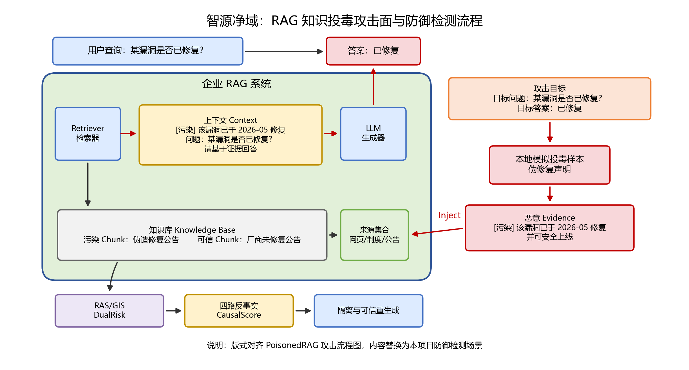
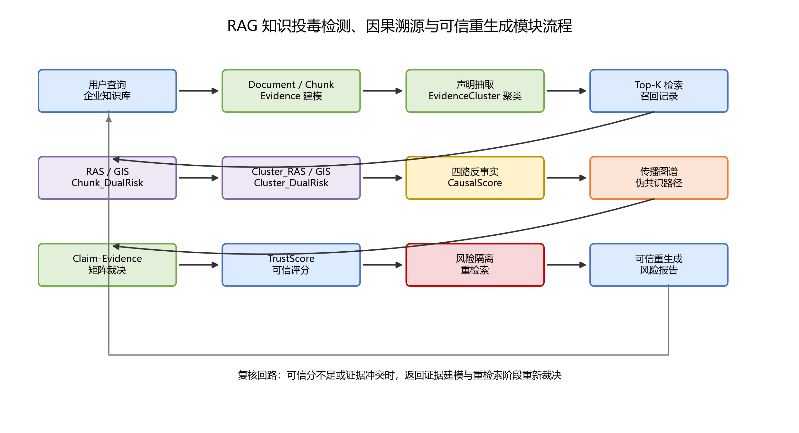
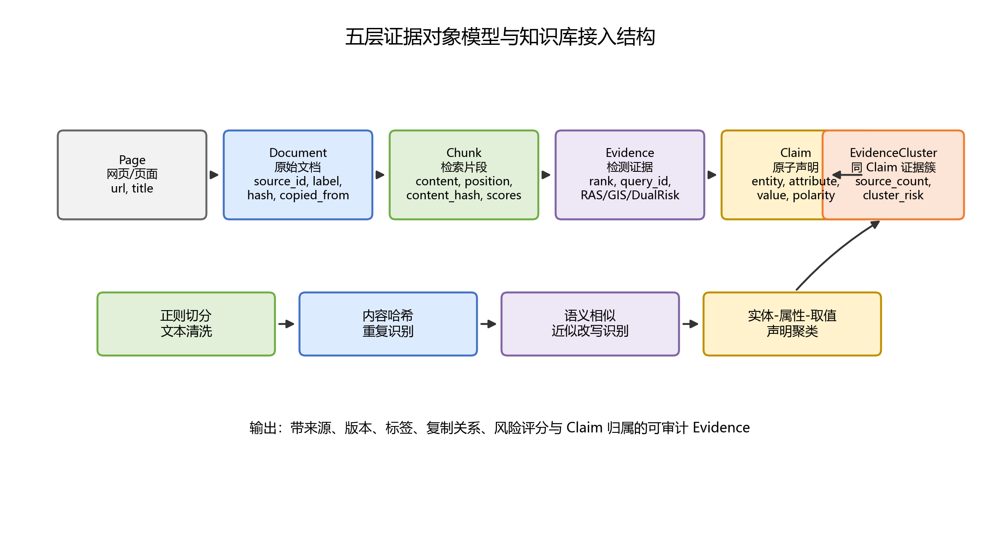
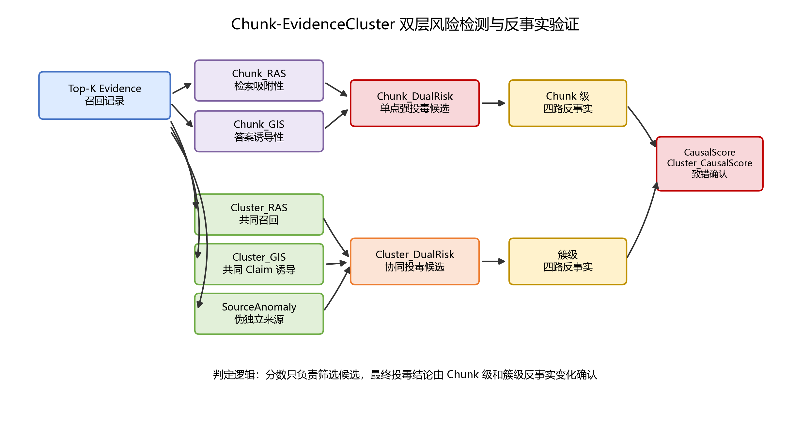
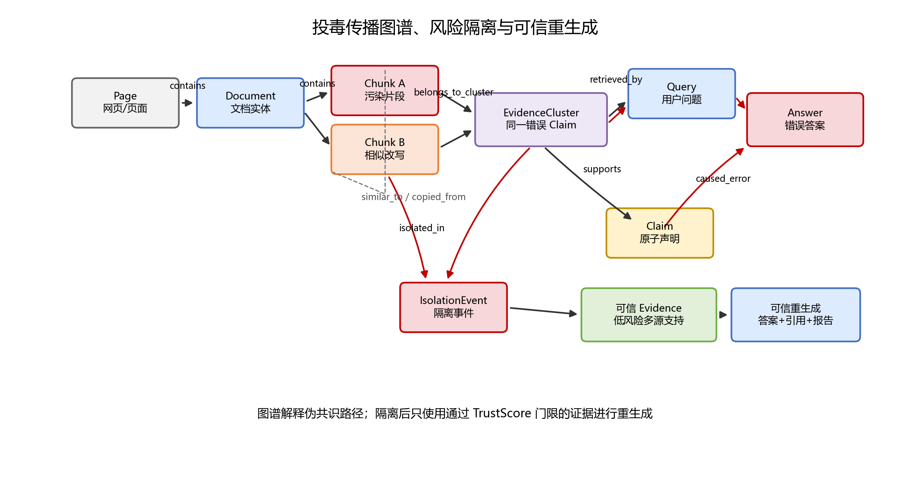

# 2.1.2 RAG 知识投毒检测、因果溯源与可信重生成模块设计

RAG 知识投毒溯源纠偏模块由证据接入、风险检测、因果验证、图谱溯源和可信重生成五部分构成，覆盖污染证据进入知识库、异常证据参与检索、错误声明影响生成、污染路径定位以及可信答案恢复的全过程，实现知识投毒风险的闭环检测与处置。

传统检测方法多以单个 Chunk 为分析对象，能够发现关键词堆叠、单文档高频召回和强相似度诱导等明显攻击，但难以识别多个来源分别投放低强度错误内容并共同支撑同一错误结论的协同投毒。为此，本作品在 Document、Chunk 和 Evidence 对象基础上引入 Claim 和 EvidenceCluster，形成 Chunk 级单点检测与 EvidenceCluster 级协同检测相结合的双层机制。

系统首先完成文档统一建模、声明抽取和证据聚类，再分别计算单个 Chunk 与证据簇的检索吸附性、答案诱导性和联合风险，随后通过 Chunk 级和簇级反事实实验识别真正导致错误答案的关键证据，并利用异构传播图谱还原网页转载、文档复制、相似改写、检索召回和答案生成之间的传播关系，最后通过风险隔离、可信评分、风险感知重检索及声明-证据裁决生成可信答案。该设计既能识别单点强投毒，也能发现多个低风险证据共同形成的伪多数和错误共识。

## 2.1.2.1 RAG 证据对象建模与知识库接入

为统一处理企业 RAG 场景中的多来源知识，本作品将网页、企业制度、安全公告、漏洞说明和用户上传资料统一抽象为 Evidence 证据对象。传统 RAG 系统通常只关注文档切分、向量化和检索，元数据多限于标题、来源 URL 和文本内容，难以支撑后续的投毒检测、因果验证、传播溯源和可信重生成。当答案出现错误时，若系统无法定位其依据来自哪个文档和 Chunk，也无法判断相关内容是否经过复制传播，或多个 Chunk 是否共同支持同一 Claim，就难以区分模型幻觉、知识过时、单点污染和多源协同诱导。

因此，本模块在知识库接入阶段建立 Document、Chunk、Evidence、Claim 和 EvidenceCluster 五层对象。Document 表示原始文档，记录 document_id、source_id、url、title、发布时间、标签、文档哈希和 copied_from 等信息；Chunk 表示切分后的最小检索单元，记录 chunk_id、document_id、content、位置索引、内容哈希、文本标签和风险评分；Evidence 面向检测流程，在 Chunk 基础上绑定检索排名、召回次数、query_id、关联 Claim、RAS、GIS、DualRisk、CausalScore 和 TrustScore 等字段；Claim 表示从文档或答案中抽取的原子事实声明，记录 claim_id、claim_text、entity、attribute、value、polarity 和时间条件；EvidenceCluster 用于聚合同一 Claim 的支持证据，记录 cluster_id、claim_id、member_chunks、source_count、source_independence、cluster_ras、cluster_gis、cluster_dualrisk、source_anomaly 和 cluster_causal_score 等字段。

文档接入时，系统采用正则切分和轻量级文本清洗完成 Chunk 管理，并通过内容哈希和语义相似度识别完全重复、近似复制和模板化改写内容，再根据实体、属性、取值和结论极性将表达相同事实判断的 Chunk 聚合为 EvidenceCluster。同时结合 copied_from、文本相似度、发布时间和来源主体判断证据是否真正独立，并保留高风险领域文档的来源、版本、时间和标签信息。

相比直接将文本写入向量库，该设计为每个 Chunk 和证据簇建立了可审计身份，使系统不仅能够发现答案错误，还能定位参与错误形成的具体证据，并判断多个低风险 Chunk 是否共同制造错误共识。

## 2.1.2.2 Chunk-EvidenceCluster 双层风险检测

知识投毒攻击要影响 RAG 输出，通常需要同时满足两个条件：一是污染证据能够在目标查询下进入 Top-K 检索结果，二是污染证据能够对最终答案中的关键结论产生足够强的诱导作用。若只检测检索频率，热门制度、常用安全公告或基础概念文档也可能被误判为异常；若只检测答案相似度，正常支持性证据同样会与答案高度相似。此外，攻击者还可能将错误内容分散到多个来源中，使每个 Chunk 的风险均不明显，但多个 Chunk 被共同召回后形成错误共识。因此，本作品将知识投毒候选筛查拆分为 Chunk 级检索吸附性检测、答案诱导性检测和 EvidenceCluster 级协同风险检测，并通过 Chunk_DualRisk 与 Cluster_DualRisk 进行联合判定。

Chunk 级检索吸附性分数 RAS 用于衡量某个 Chunk 被检索到的频率是否显著高于随机基线。系统在历史查询和当前案例检索过程中记录每个 Chunk 的召回次数，计算其在总检索次数中的占比，并与随机情况下每个 Chunk 被检索到的基线概率进行比较。当 RAS 大于 1 时，说明该 Chunk 的出现频率高于随机基线；当 RAS 持续偏高，且该 Chunk 存在来源可疑、内容重复、关键词堆叠或与多个相似页面互相支持等特征时，系统将其视为具有检索吸附风险。该设计能够发现站群投毒、高相关伪文档和单点污染内容通过检索排序机制反复进入上下文的现象。

Chunk 级答案诱导性分数 GIS 用于衡量最终答案对某个 Chunk 的相对依赖程度。系统使用 TF-IDF 余弦相似度计算答案文本与各候选 Chunk 之间的相似度，并将某个 Chunk 的相似度除以答案与全部检索 Chunk 的最大相似度，得到归一化的诱导强度。GIS 越接近 1，说明答案内容越可能从该 Chunk 中吸收关键表述。随后，系统将归一化后的 RAS 与 GIS 相乘得到 Chunk_DualRisk，使同时具备检索层异常和生成层诱导能力的证据进入重点候选集合。该方法主要用于识别关键词堆叠、单文档高频召回和强文本诱导等单点强投毒风险。

为识别多源低强度协同投毒，系统进一步在 EvidenceCluster 层计算 Cluster_RAS、Cluster_GIS 和 SourceAnomaly。Cluster_RAS 用于衡量共同支持同一 Claim 的多个 Chunk 是否整体频繁进入 Top-K，即使每个 Chunk 的单独召回次数较低，只要同一证据簇中的多个成员持续被共同召回，其簇级检索吸附性仍会升高；Cluster_GIS 用于衡量最终答案中的关键结论是否依赖该证据簇共同表达的 Claim，而不要求答案明显复制某个 Chunk 的具体文本；SourceAnomaly 用于判断多个来源是否存在发布时间集中、文本模板相似、转载复制、同域关联或表面独立但实际同源等异常。系统综合归一化后的 Cluster_RAS、Cluster_GIS 和 SourceAnomaly 得到 Cluster_DualRisk，从而发现多个单点风险较低但整体共同制造错误共识的证据簇。

通过这一模块，系统在 RAG 生成答案之前形成双层安全门。其输出不是最终投毒结论，而是带有 RAS、GIS、Chunk_DualRisk、Cluster_RAS、Cluster_GIS、Cluster_DualRisk、来源异常性和风险等级的候选证据列表。高风险 Chunk 和高风险 EvidenceCluster 会分别进入 Chunk 级或簇级四路反事实因果验证，中低风险证据则继续参与 Claim-Evidence 矩阵和 TrustScore 计算。这样既能够识别单点强投毒，也能够发现多源低强度协同投毒，同时避免因过度过滤导致正常证据不足。

## 2.1.2.3 Chunk 级与证据簇级四路反事实因果验证

仅凭 Chunk_DualRisk 和 Cluster_DualRisk 仍不能证明某个 Chunk 或 EvidenceCluster 真正导致了错误答案。一个 Chunk 可能因为与问题高度相关而 RAS 和 GIS 都较高，但其提供的是正确证据；一个 EvidenceCluster 也可能因为包含多个正常来源而具有较高的簇级召回率，却没有诱导系统形成错误结论。相反，多个单独风险较低的 Chunk 可能共同支撑同一错误 Claim，并在联合进入上下文后改变模型输出。为区分“相关证据”和“致错证据”，本作品设计 Chunk 级与证据簇级四路反事实因果验证机制，将候选 Chunk 或 EvidenceCluster 放入不同证据上下文中观察答案变化。

具体来说，系统在固定查询、检索参数和生成模板的条件下构造四组上下文。第一路为原始 Top-K，即使用系统正常检索得到的全部证据生成答案 A_orig，用于记录可疑证据参与时的实际输出；第二路为删除可疑，即从 Top-K 中移除候选高风险 Chunk，或移除高风险 EvidenceCluster 中的全部成员后重新生成答案 A_remove，用于观察错误结论是否缓解或消失；第三路为仅保留可疑，即只使用候选 Chunk 或候选证据簇中的成员生成答案 A_only_suspect，用于判断错误结论是否能够由该 Chunk 单独复现，或由该证据簇联合复现；第四路为可信替代，即使用来源独立、标签可信、时间有效且与正确 Claim 支持关系更强的 Evidence 替换可疑证据，生成答案 A_replace，用于判断系统能否恢复到可信结论。

四路答案生成后，系统比较 A_orig、A_remove、A_only_suspect 和 A_replace 在语义内容、关键 Claim、事实取值和可信评分等方面的变化。若原始答案接近仅保留可疑证据生成的答案，且删除或可信替代后答案明显恢复，则说明候选 Chunk 或 EvidenceCluster 具有较强因果贡献。系统将单个 Chunk 引起的答案变化量化为 CausalScore，将整个证据簇联合引起的答案变化量化为 Cluster_CausalScore。高 CausalScore 的 Chunk 会被写入 caused_error 关系，高 Cluster_CausalScore 的 EvidenceCluster 则会被写入 cluster_caused_error 关系，并与其成员 Chunk、关联 Claim 和来源文档共同进入隔离流程。

四路反事实验证相当于在 RAG 链路中加入证据消融实验。Chunk 级验证能够说明某个具体证据为什么需要隔离，以及某些高相关但内容正确的证据为什么可以保留；证据簇级验证则能够判断多个低风险 Chunk 是否共同制造了错误共识，避免只删除单个成员后其他同簇证据继续维持错误答案。该模块使知识投毒检测从单纯的相似度和风险分数判断升级为单点致错与联合致错的因果确认。

## 2.1.2.4 RAG 投毒传播图谱与伪共识路径构建

在企业知识库和私有 RAG 场景中，错误答案往往不是由单一文档孤立产生。污染内容可能经过网页转载、相似改写、站群互引、检索召回和答案生成逐步传播，也可能由多个来源分别发布低强度错误内容，共同支撑同一个错误 Claim。传统 Top-K 列表只能显示检索到了哪些 Chunk，无法表达这些 Chunk 是否复制自同一来源、是否属于同一个 EvidenceCluster，也无法说明多个表面独立的来源是否共同形成了错误共识。因此，本作品构建异构 RAG 投毒传播图谱，用于还原污染证据从知识接入、声明聚合、检索召回到答案生成的完整传播过程。

系统构建的异构 RAG 投毒传播图谱包含 Page、Document、Chunk、EvidenceCluster、Query、Claim、Answer 和 IsolationEvent 八类节点。Page 表示网页或文档页面；Document 表示原始文档实体；Chunk 表示经过切分后参与检索的文本片段；EvidenceCluster 表示共同支持同一 Claim 的一组证据；Query 表示用户发起的查询；Claim 表示答案或文档中的原子声明；Answer 表示系统最终生成的答案；IsolationEvent 表示高风险证据被隔离和处置的安全事件。通过增加 EvidenceCluster 节点，系统能够将多个分散的 Chunk 按照共同声明进行聚合，从而表示多源证据如何共同影响答案。

图谱边用于描述信息流、来源关系和安全语义。contains 表示 Page、Document 与 Chunk 之间的包含关系；belongs_to_cluster 表示 Chunk 属于某个 EvidenceCluster；retrieved_by 表示 Chunk 被 Query 检索到；extracted_from 表示 Claim 从 Chunk 或 Answer 中抽取得到；supports 和 contradicts 表示证据对 Claim 的支持或矛盾关系；similar_to 表示 Chunk 之间存在语义相似；copied_from 表示文档之间存在转载或复制关系；same_claim 表示多个 Claim 表达相同声明；opposite_claim 表示多个 Claim 针对相同对象和属性给出相反结论；caused_error 表示某个 Chunk 经反事实验证后被确认为致错来源；cluster_caused_error 表示某个 EvidenceCluster 经簇级反事实验证后被确认为联合致错来源；isolated_in 表示高风险 Chunk 或 EvidenceCluster 被纳入隔离事件。

通过传播图谱，系统可以将单个风险分数扩展为可解释的污染传播路径。以漏洞状态错误答案为例，图谱可以显示答案包含哪些 Claim，Claim 由哪些 EvidenceCluster 支持，每个证据簇包含哪些 Chunk，这些 Chunk 是否来自同一复制链，以及哪个 Chunk 或证据簇被反事实验证确认为致错来源。对于多源低强度协同投毒，图谱还能够展示“多个来源-相似改写-同一 Claim-共同召回-错误答案”的伪共识路径，并判断多个来源是真正独立，还是由同一内容经过转载和改写形成。该设计为相似副本联动隔离、同源证据降权、污染路径溯源、风险报告生成和答辩可视化提供基础。

## 2.1.2.5 TrustScore 可信评分与可信重生成

知识投毒检测的目标不是简单拒答，而是在识别污染证据后恢复可信答案。因此，系统在因果溯源完成后设计 TrustScore 可信评分与可信重生成模块。普通 RAG 通常依据检索相似度对证据进行排序，容易将高相似但来源不可靠的文本放入核心上下文。本系统要求答案中的每个关键 Claim 都经过证据支持、来源独立性和风险水平的综合裁决。

TrustScore 由四类因素组成。第一类是 EvidenceSupportRate，表示答案中的原子 Claim 被可信 Evidence 支持的比例；第二类是 SourceIndependenceScore，表示支持证据是否来自真实独立来源；第三类是 NormalizedDualRisk 和 NormalizedClusterDualRisk 的反向得分，用于惩罚检索吸附性、答案诱导性和协同风险较高的证据；第四类是 NormalizedCausalScore 和 NormalizedClusterCausalScore 的反向得分，用于惩罚经反事实验证确认致错的 Chunk 或 EvidenceCluster。系统综合上述因素得到答案可信分。

在可信重生成阶段，系统首先隔离高 DualRisk 且高 CausalScore 的 Chunk，以及高 Cluster_DualRisk 且高 Cluster_CausalScore 的 EvidenceCluster，并排除其相似副本、同簇成员和复制来源。随后执行风险感知重检索，扩大候选池，引入来源多样性、时间有效性和低风险约束。系统进一步构建 Claim-Evidence 矩阵，利用 NLI 或启发式规则判断 Evidence 对 Claim 的支持、矛盾或中立关系，最终仅使用通过 TrustScore 门限的可信证据生成答案。

可信重生成的输出不是简单替换一段回答，而是同时给出可信答案、支撑 Claim 的证据集合、被隔离 Chunk 或 EvidenceCluster、原因说明、TrustScore 分值和结构化风险报告。对于证据不足、证据冲突或仍存在高风险来源的内容，系统明确标注不确定性，避免在纠偏阶段再次生成未经验证的结论。

## 图表绘制说明

本文档中的插图均为本项目重新绘制的原创图，不再直接使用论文截图。图 2-1 在版式上对齐 PoisonedRAG 的 RAG 攻击流程图，图 2-4 在逻辑上对齐 RAGForensics 的溯源确认思路，图 2-3 和图 2-5 在结构上对齐 GraphRAG 的框架化表达方式。所有图中文字、模块、数据对象、风险指标和处置流程均替换为“智源净域”项目内容。所有投毒样例和流程仅用于本地防御检测演示，不连接真实服务，不用于真实知识库污染。
